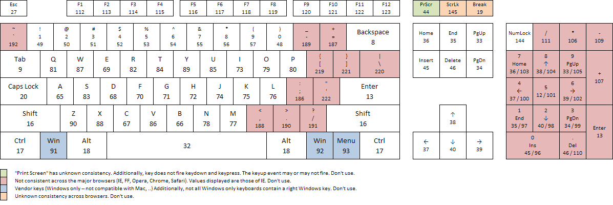

#### DOM events

- on / addEventListener 

- Event Object 

#### on mouse

- click      
- dblClick   
- mouseLeave
- mouseOver
- mouseMove
- mouseDown
- mouseUp
- mouseenter

#### on keyboard

- keyDown
- keyUp
- keyPress

#### Browser / Window events

- DOMContentLoaded / loaded
- scroll
- resize

### Maping

- forEach
- map
- filter 
- reduce

## extra String 

str.subString(0, n)

