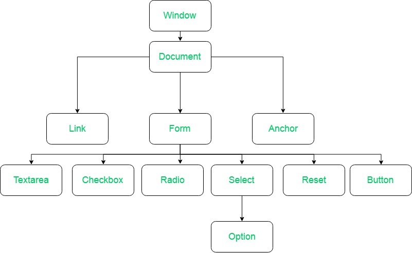

## DOM 

#### Document object model



### DOM selectors

```


- getElementById('element_id')
- getElementsByTagName('element_tag_name')
- getElementsByClassName('element_class_name')
- querSelector("#id" , "tag_name" , ".calass_name")
- querSelectorAll("tag_name" , ".calass_name")


- window.document.getElementById('element_id');

```