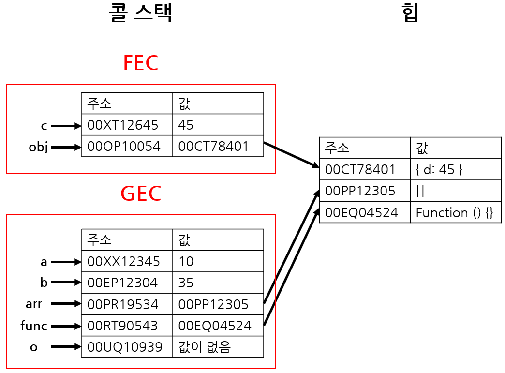

#### JavaScript Core

- "use strict"
- Data types (Reference and Primitive)
- Variables ( var , let , const )
- Conditional operators ( if else , switch , ternary )  
- Number & Mathematic Functions 
- String , String methods
- Number , Number methods
- Boolean , Boolean methods
- Type conversions vs correction
- Truthy , Falthy 
- Nullish , Optional chaining , nullish colasing ?? 
- Loops ( while , do while , for , for of , for in )
- Array  ( literal , new Array )
- Array methods ( push , pop ,shift , unshift , slice , splice , evry , join , reverse , etc...)
- Object , Object methods , spread , object destructors 
- Object.entries , Object.fromEntries , Object.freeze ... etc
- this keyword
- Deep copy or Shallow copy
- Advanced functions  ()
- Functions factory , Function pipe , Function generator , Function Currying , IIFE ...
- Higher order functions: map , filter , foreach , reduce , sort 

###  DOM

- ### selector 

- getElementById , getElementsByTagName , getElementsByName , (HTMLCollection)
- querySelector , querySelectorAll (NodeList)

- Styiling elements el.stytle.property="value" , el.stytle.cssText="property:value"
- CSSstyleDecloration

- Attribute , setAttribute , getAttribute , hasAttribute 
- ClassList , add , remove , toggle , contains

- ### Dynamic elemts in DOM 
- createElement('element')
- appendChild
- append
- prepend
- before , after


- ### DOM events

- mouse events
- keyboard events
- window events

<hr>


### Call stack and Heap



<hr>


## Data types:

- #### primative

- number 
- string
- boolean
- undefined
- null
- Symbol
- bigInt

- #### reference or non primitive

- Object 

- Function
- Proxy
- Array 
- Object 
- Map 
- Set 


### Array methods

array literal : [ el1, el2, el3, el4, el...etc ]
array[index]

```
let array=[];

array[0]="Html";
array[1]="CSS";
array[2]="JavaScript";

array.push('html'); // ohiridan 
array.push('css');
array.pop(); // ohiridan o'chiradi

array.unshift("Nodejs") // arrayni boshidan qo'shadi
array.shift(); // boshidan o'chiradi


```


