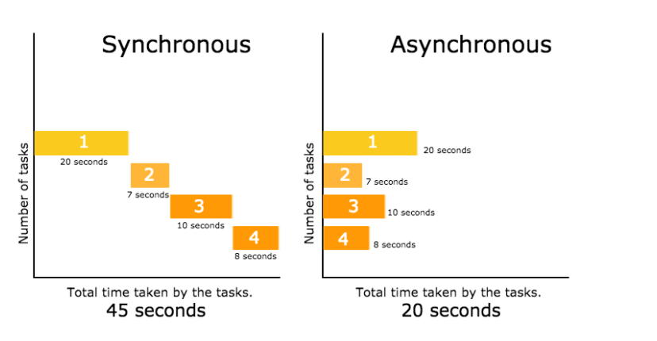
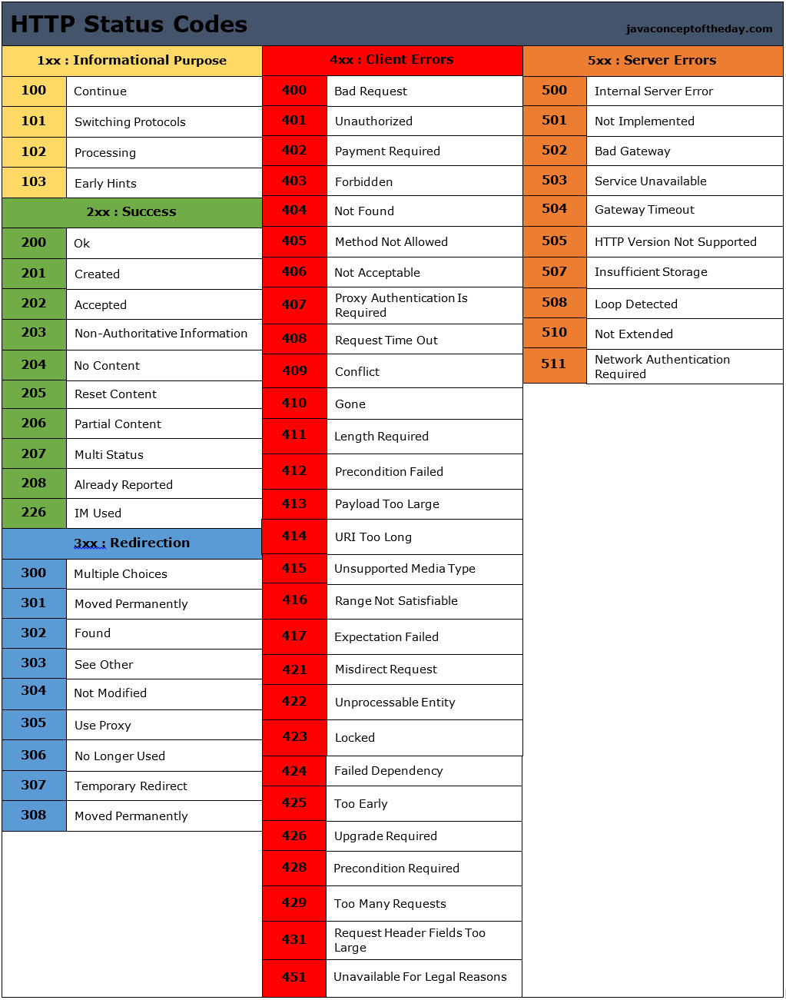

#### FUNCTIONS

- Javascript syncronous
- JavaScript asynchronous


- Promise 

1. resolve
2. reject

1. then 
2. catch
3. finally

- Promise methods




```
const myPromise = new Promise((resolve, reject) => {
  setTimeout(() => {
    resolve("foo");
  }, 300);
});

myPromise
  .then(handleFulfilledA, handleRejectedA)
  .then(handleFulfilledB, handleRejectedB)
  .then(handleFulfilledC, handleRejectedC);


```

